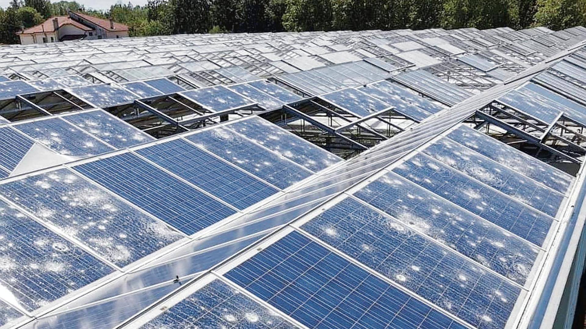
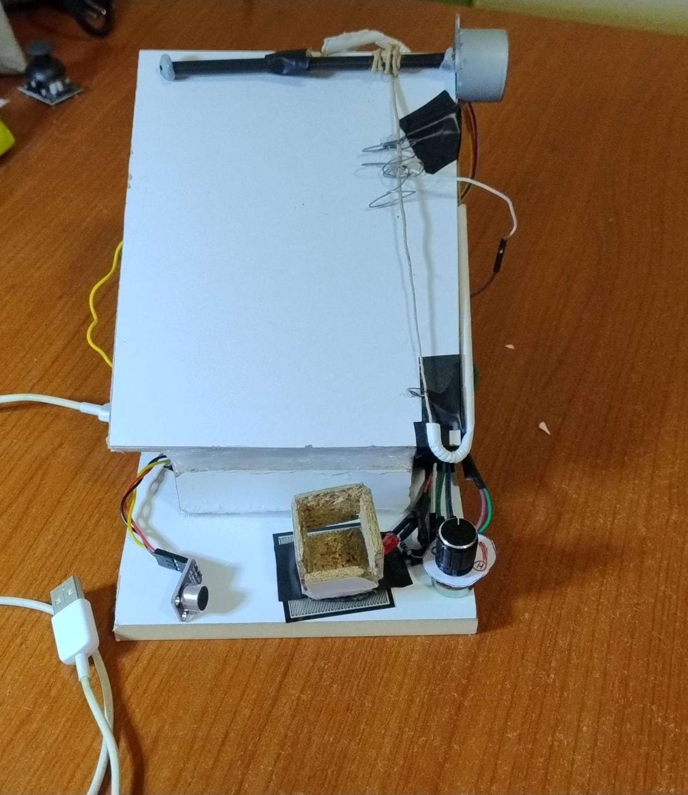
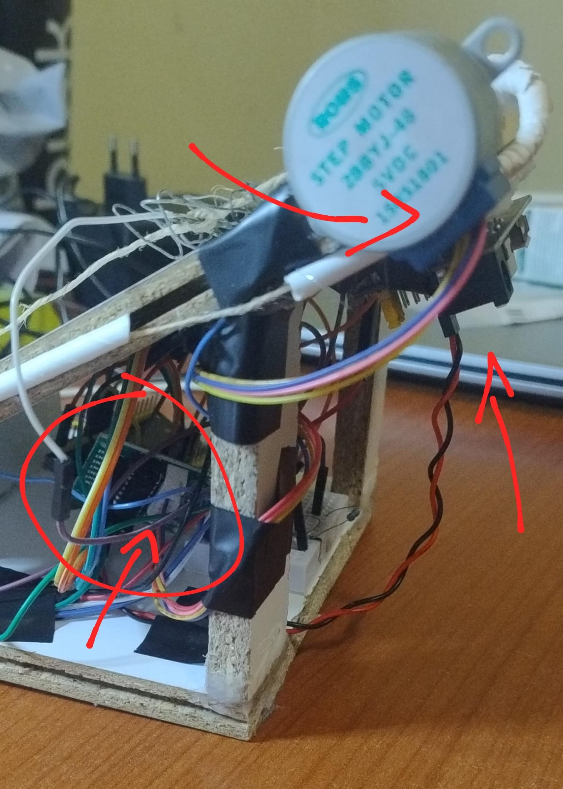
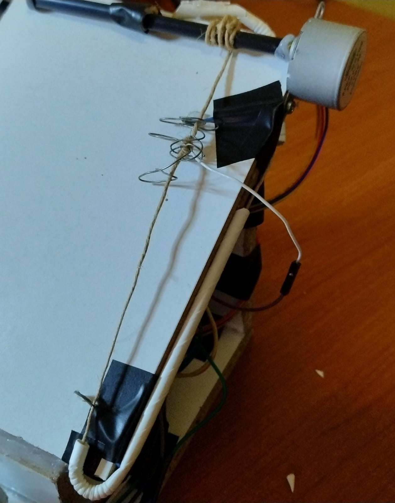
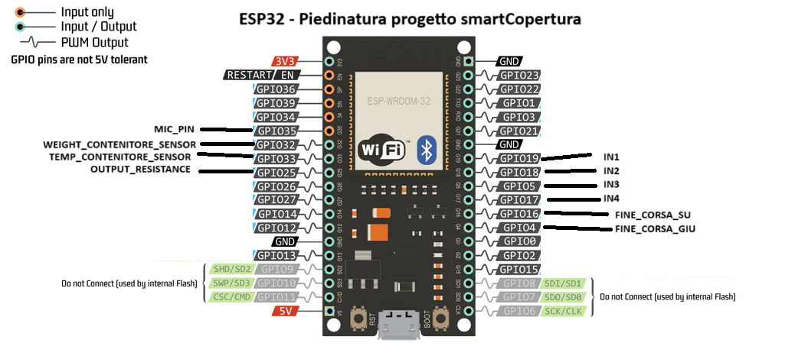

# smartCopertura_sisemb
Sistema di copertura automatico contro grandine e intemperie - Progetto Sistemi Embedded di Antonio Mazzaccaro

Il progetto consiste nella realizzazione di un sistema di copertura in grado di riconoscere e azionarsi a fronte eventi atmosferici avversi intensi (in questo prototipo si tengono conto della grandine e della pioggia di cenere vulcanica), facendo scendere una sorta di "saracinesca" resistente.
In un'epoca in cui i fenomeni meteorologici estremi sono in netto aumento questo sistema troverebbe molto impiego ad esempio nella protezione di pannelli solari, oppure nell'agricoltura (le grandinate forti distruggono tranquillamente le coperture tradizionali delle serre).

Il riconoscimento di tali fenomeni avversi passa per un'analisi dell'audio ambientale, tramite un microfono, e dalla raccolta in un piccolo recipiente dei chicchi di grandine (o del materiale vulcanico), tramite un sensore di pressione che ne segnala la presenza, mentre la chiusura della "saracinesca" si compie azionando un motore.
Alla fine della grandinata i chicchi presenti nel recipiente (opportunamente bucato, simile a uno scolapasta) vengono scaldati con una resistenza per scioglierli in base alla loro temperatura (feedback closed-loop), mentre, in caso di una pioggia di cenere vulcanica, chiaramente non si possono sciogliere i detriti accumulati: questo sarebbe l'unico caso in cui, nella realtà, si renderebbe necessario l'intervento umano per poter riprendere a funzionare correttamente.
Il sistema acquisisce anche informazioni sul meteo attuale dalla rete, per cercare di ridurre i falsi-positivi e i falsi-negativi, combinando la probabilità di eventi estremi riportata con il grado di confidenza ottenuto dalla valutazione dei suddetti input (suono e peso).

## Hardware
Il prototipo è realizzato con un'ESP32-WROOM32, il quale combina la presenza del modulo WiFi per la connettività e un discreto numero di GPIO (alcuni dei quali dotati anche di DAC e ADC, oltre alla PWM) alle discrete prestazioni dei due core Xtensa a 240MHz. Al SoC sono collegati il microfono per il riconoscimento del suono della grandine, un sensore di pressione, sopra il quale è collocato il cestello che raccoglie i chicchi, un sensore di temperatura (che nell'ambito della demo sarà sostituito da un potenziometro per poter pilotare la temperatura voluta), una resistenza riscaldante (che per ovvi motivi, come per il sensore di temperatura, sarà sostituita da un LED rosso), un ponte H per pilotare il motore che aziona la "saracinesca" e due fine-corsa per fermarne l'apertura e la chiusura.
L'unico piccolo inconveniente è dato dalla sensibilità del sensore di pressione in possesso (di tipo a film sottile), il quale necessita di un peso leggermente più alto di quello di una biglia (o di una pallina dei vecchi mouse) per abbassare la sua resistenza iniziale e far passare una corrente tale da rilevare la presenza di grandine, quindi nella dimostrazione bisogna talvolta aiutarsi con le dita per "spingere verso il basso" il cestello e produrre un peso sufficiente.

Il motore utilizzato nel prototipo è uno step-motor: tale scelta è dovuta principalmente alla precisione maggiore rispetto ad un motore in corrente continua (sia in termini di posizione e sia in termini di regolazione della velocità). Uno svantaggio di tale scelta è che il motore rimane sempre alimentato, anche da fermo. Il ponte H preleva l'alimentazione "di potenza" da un modulo di alimentazione per breadboard, che gli eroga 5V con una corrente decisamente maggiore a quella erogabile dall'ESP32, che non basterebbe per azionare il motore.

I fine-corsa usati in questo progetto sono "improvvisati", infatti sono stati realizzati con tre cavetti semi-rigidi, di cui due fissati nei punti di massima apertura e massima chiusura, piegati in modo da fare contatto col cavetto che porta tensione, il quale è fissato sulla cinghia che trasporta la saracinesca.

Il supporto è interamente in legno di recupero.

## Software
Sono utilizzate le seguenti librerie:
- **WiFi.h** per l'utilizzo del modulo WiFi per la connettività;
- **TaskScheduler.h** per la suddivisione del programma in task da eseguire a intervalli regolari;
- **ArduinoJson.h** per ottenere le info sul meteo dal payload della risposta dell'API meteo;
- **Stepper.h** per pilotare il motore sia in senso orario (apertura saracinesca) che anti-orario (chiusura);
- **PID_v1.h** per elaborare l'intensità di accensione della resistenza in base al feedback sulla temperatura del cestello.

Il programma è suddiviso nei seguenti task:
- **audioTask** ogni 10 millisecondi, per campionare l'audio ambientale e riconoscere una serie di colpetti generati dalla caduta dei chicchi di grandine;
- **chiediMeteoTask** ogni 120000 millisecondi, per richiedere info meteo aggiornate;
- **leggiRispMeteoTask** ogni 5000 millisecondi, fa effettivamente qualcosa solo se è stata prima fatta una richiesta all'API meteo ed è arrivata la risposta dentro al client WiFi;
- **checkTask** ogni 500 millisecondi, effettua il calcolo del grado di confidenza sulla presenza di grandine, combinando peso, rumore e dati meteo, e si comporta di conseguenza aprendo o chiudendo la copertura, oppure scaldando il cestello tramite la resistenza usando il controllo closed-loop PID sulla temperatura.

Per semplicità di scrittura del programma si considera lo startup del sistema come l'unico momento di inizializzazione e taratura dei sensori, si assume pertanto che il sistema venga avviato in una situazione di assenza di rumori e di oggetti nel cestello e che il potenziometro della temperatura sia inizialmente posizionato sulla temperatura ambiente ragionevole (verso il centro). L'introduzione di un secondo sensore che misuri la temperatura dell'ambiente circostante, oltre a quello del recipiente, risolverebbe il problema della taratura, in quanto ogni volta la temperatura target da raggiungere sarebbe quella dell'ambiente misurata di volta in volta, e non quella inizialmente tarata lasciando il potenziometro a metà, come descritto poc'anzi.

Per la decisione di chiusura della copertura viene tenuto conto sia della confidenza calcolata nel calcolo precedente e sia la confidenza appena calcolata, con pesi rispettivamente del 40% e del 60%.
Nel calcolo della confidenza incidono il peso (per il 35%), la rilevazione del rumore (per il 45%) e il meteo (per il 20%).
L'API meteo usata restituisce dei codici numerici univoci per ogni situazione atmosferica e, tali codici, sono particolarmente facili da interpretare in quanto la differenza aritmetica di tali codici dal multiplo di 5 subito precedente determina l'intensità del fenomeno, quindi si può usare tale differenza come una scala che indichi la probabilità che si verifichi un fenomeno estremo. Qualora non sia presente connettività per ottenere le info meteo, il sistema continuerà a funzionare basandosi sui restanti input, considerando l'apporto della parte meteo pari a 0.

Nel calcolo PID per il controllo della temperatura all'interno del cestello sono state scelte le costanti Kp=0.8, perché tanto più la temperatura si abbassa, tanto più bisogna riscaldare, Ki=0, perché importa poco la "storia" delle rilevazioni di temperatura, Kd=0.1, perché in base alla velocità con cui varia la temperatura è opportuno regolare conseguentemente l'output sulla resistenza.
Le costanti sono basse perché è stato notato che la libreria produceva spesso un output "a fondoscala" anche per scostamenti bassi dal target, mentre con i suddetti valori l'output è diventato ragionevole.
Bisogna rilevare che questa libreria PID ha delle limitazioni: una su tutte è la limitazione dell'output a 255 in PWM, perché è stata pensata per Arduino, mentre l'output di ESP32 in PWM è maggiore, usando una PWM a 10 bit il massimo è 1023, quindi si sono rese necessarie delle operazioni di mappatura dei valori su un altro intervallo, tramite l'istruzione map().

## Possibili miglioramenti
Un possibile miglioramento potrebbe essere la rilevazione delle condizioni di luminosità tramite una fotoresistenza (è difficile che grandini col sole), oppure si potrebbe anche impiegare un'intelligenza artificiale in grado di riconoscere il rumore della grandine e discernerlo, ad esempio, dal verso di una cicala...